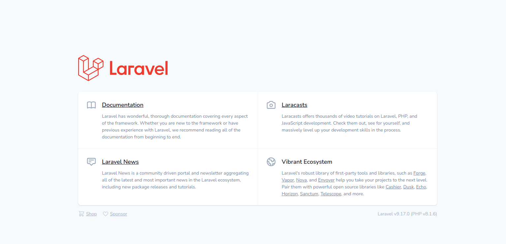

## Service Ticket Center
### This project is the dockerised version of the ticket center backend.

## Building with Docker 🐬
1. In the root directory copy .env.docker.example, past and rename the file to .env
2. In the laravel directory copy .env.example, past and rename the to .env

### Using the container
1. Build the docker image

```bash
$ make build
```
* If everything is working fine, you can go to http://ticket-center-app.docker:8088/ and see this:



### More docker shortcuts

1. Login to the container

```bash
$ make login
```

### Other useful shortcuts

2. Stop the container

```bash
$ make stop
```

3. Login to the container

```bash
$ make login
```
4. Show logs of the app container

```bash
$ make logs
```

5. Restart all containers

```bash
$ make restart
```

6. Check root path inside the container

```bash
$ make test
```

7. Clear Symfony Cache and eventually OpCache (production)

```bash
$ make flush
```

8. Check the status of all containers

```bash
$ make status
```

9. Add an NGINX sites config in case you look for a reverse-proxy setup (check the ```NGINX_SITES_PATH``` option below)

```bash
$ make proxy
```

### Development build: (```PLATFORM_ENVIRONMENT=dev```)

* XDebug:

  * Port is ```9000```
  * Version is ```3.1```
  * use the ```APP_NAME``` value defined in your [.env](./.env) file as a server-name while configuring xdebug in PHP Storm.

* [PHP SPX Profiler ](https://github.com/NoiseByNorthwest/php-spx.git) (check full documentation under their github repo)

### Production build:

* OPCache: Please take time to read the comments in the [php.prod.ini](./php-fpm/php.prod.ini) for full details
* [Cache Tool](https://github.com/gordalina/cachetool)

## Customizing the container

* It is possible to customize the container build through some parameters defined in the [.env](./.env) file:
* P.S: In order to have these settings take effect, you have to rebuild your container, i.e do a or ```make down``` then or ```make build```

  * ```PHP_VERSION``` : possible values are ```7.1```, ```7.2```, ```7.3```, ```7.4```, ```8.0```, ```8.1``` (```5.6``` ?!)

  * ```PHP_MEMORY_LIMIT``` : for example,  ```4G``` or ```256M.```. This value will be ignored and automatically set to -1 (unlimited) if ```PLATFORM_ENV=dev```

  * ```PLATFORM_ENVIRONMENT``` : if set to ```dev```, it ensures a develoment container build. Can also hold values like ```alpha```,  ```beta```, ```prod```.

  * ```LC_ALL``` : Sets all localization settings, except the language. for example, ```C.UTF-8``` or ```de_DE.UTF-8```

  * ```LANG``` : Sets the system language, for example, ```C.UTF-8``` or ```de_DE.UTF-8```

  * ```TZ``` : the timezone, for example, "Europe/Berlin"

  * ```DOCKER_MONGO_PERSIST_FOLDER``` : The folder under which the mongodb data will be persisted, for example, or ```./etc/mongo``` or ```/var/dev/mongo```

  * ```DOCKER_MONGO_PORT```: The default port for accessing ("from outside") to the mongodb server, default is ```27017```

  * ```DOCKER_NGINX_PORT```: The HTTP port for accessing your web app. default is ```8088```
  *
  * ``NGINX_SITES_PATH``: The path of your host (not docker) nginx sites folder(default is ```/etc/nginx/sites-enabled```).
    This values is used when you run the ```make proxy``` command, it adds a new nginx site config that forwards any host requests to the docker server.
    Check [reverse-proxy.conf.dist](./etc/reverse-proxy.conf.dist) for more details.

## More options!

* Have a look at [.env file](./.env) and play around with constants to tackle the setups
* For instance, if you change the DEPLOYMENT_ENV from dev to prod, you already activate xdebug and PHP-SPX profiler..
